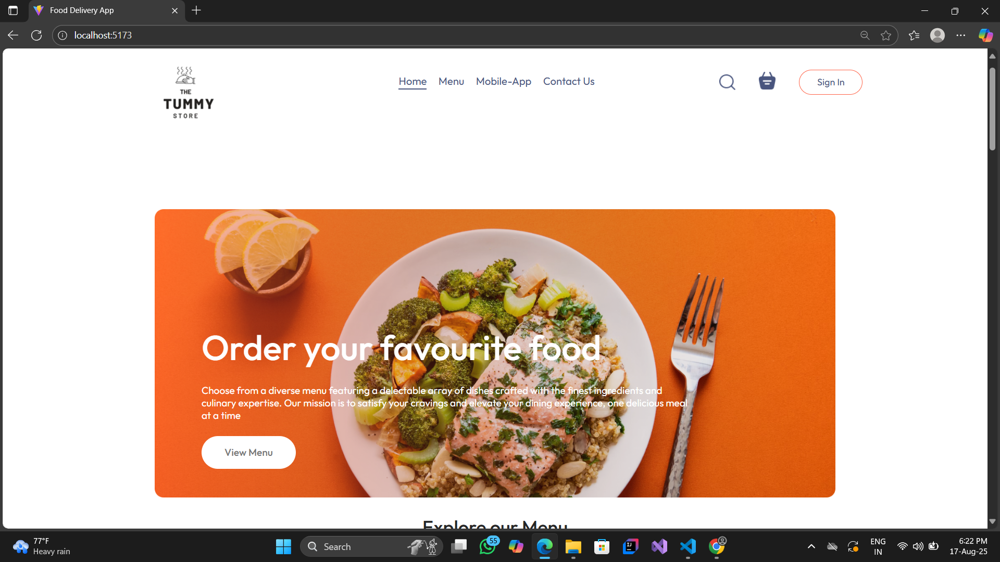
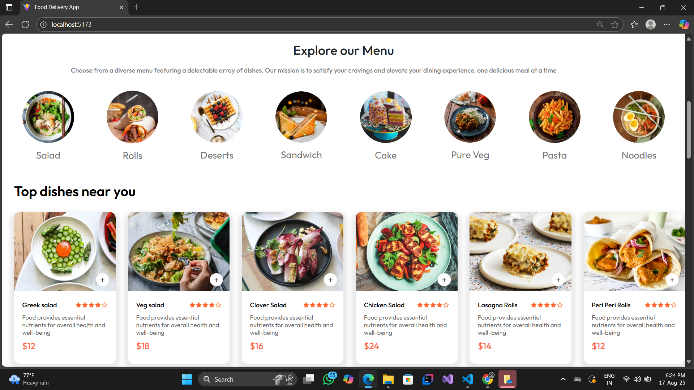
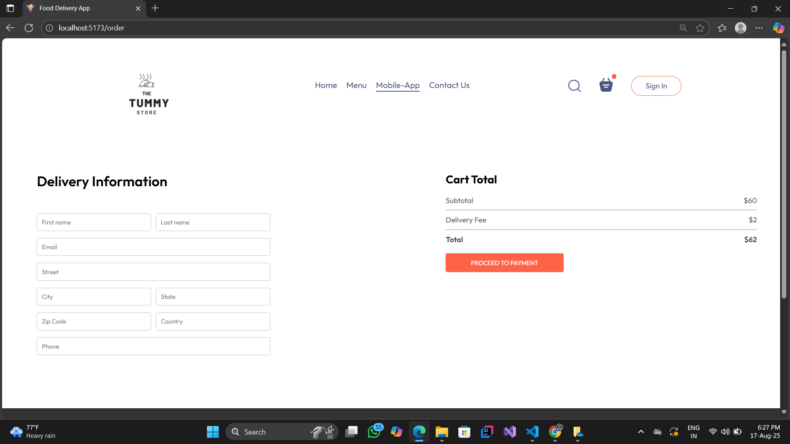

# The Tummy Store 🍔🍕🍱

**The Tummy Store** is a modern **food delivery frontend application** built using **React.js**. It allows users to explore menus, view app features, and interact with a responsive and visually appealing interface.  

> ⚠️ This project only contains the **frontend**. Backend is not included yet.

---

## Features

- Responsive **navbar** with smooth section navigation
- Video logo for branding
- Menu section to showcase available dishes
- Mobile app download section
- Contact/ footer section
- Search bar and shopping basket icon
- User-friendly **Sign In** button (frontend only)
- Active menu highlighting as users scroll

---

## Tech Stack

- **React.js** for frontend development
- **CSS** for styling and responsive design
- **React Router** for navigation
- **Video & image assets** for branding

---

## Screenshots

### Home Page

### Menu Section

### Cart page

### Delivery Section

---

